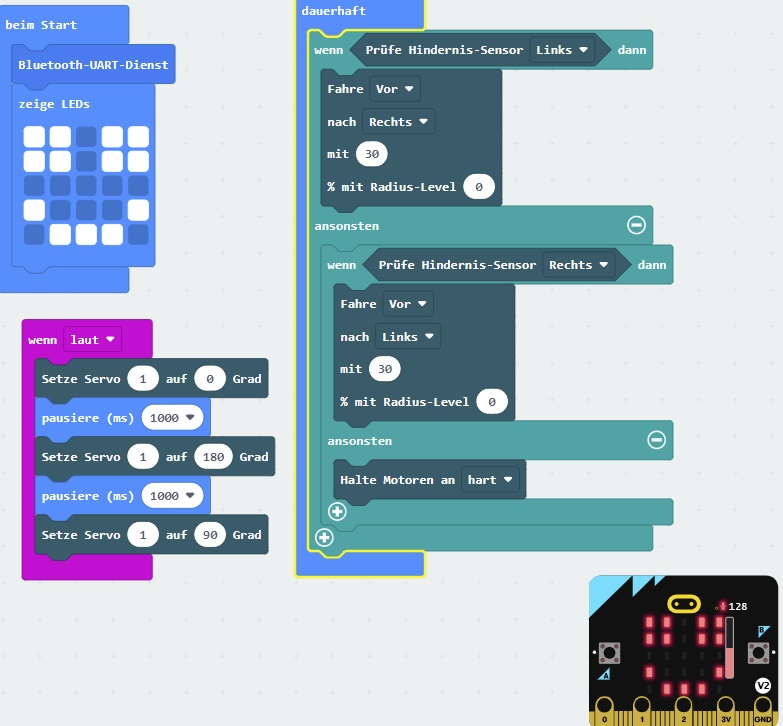

# MINT-Robi: Playfully creative in Math-Computer-Science and Technology / Spielerisch kreativ in MINT-Fächern

[Click to play the adventure game...](https://kiliansinger.github.io/mintrobi/?lang=EN)

[Klicke hier um das Abenteuerspiel zu spielen..](https://kiliansinger.github.io/mintrobi/)

Credits:

* Game engine: Kilian Singer
* Story-code: Kilian Singer, Miriam Mendoza Delgado, Jonas Proll
* Story/graphics: Marika Singer
* Crowdfunding: Ricky-Joe Plate
* Tutorials: Bernd Bauerhenne.

The game was supported by [Smart City Kassel](https://www.startnext.com/pages/unikat/campaign/smart-city-kassel-344#/) and the [SFB-ELCH (Uni-Kassel)](https://www.uni-kassel.de/forschung/sfb/sfb-1319-elch/).

 
 

[MINT-Robi](https://www.startnext.com/mint-robi?utm_source=startnext&utm_medium=extwidget&utm_campaign=projectwidget&utm_term=projectpromo)

Schülerinnen und Schüler lösen spielerisch ein Abenteuerspiel mit Programmier-, Elektronik- und Physikproblemen und finden tolle Praktika bei Firmen

Schüler\*innen lösen im Abenteuerspiel Programmier-, Elektronik- und Physikprobleme, um MINT-Robi weiterzuentwickeln.

Firmen können über Schul-Sponsoring für Praktika werben und nachhaltig MINT begabte Mitarbeiter in der Region gewinnen.

## Crowdfunding 16.08.-13.09.2022

Ein Überblick über unsere Crowdfunding Kampagne (Fundingziel: erreicht):

#### [Bauplan: 10 €](https://www.startnext.com/mint-robi/ds/d/sn-technik/sn-software-apps/bauplan-i390532.html)

Erlangen Sie permanenten Zugang zum Spiel und erhalten sie einen kompletten Bauplan mit Bauteilliste.

Achtung: Dieses Angebot ist limitiert auf 300 Stück. [Details](https://www.startnext.com/mint-robi/ds/d/sn-technik/sn-software-apps/bauplan-i390532.html)

#### [MINT-Robi Kauf: 100€ ](https://www.startnext.com/mint-robi/ds/d/sn-technik/sn-technik-sonstiges/mint-robi-kauf-i390533.html)

Erhalten sie MINT-Robi mit Zugang zum Spiel und allen Unterlagen. Durch die Förderung von Smart City Kassel wird maximal bis zum Erreichen des Kampagnenziels ein weiterer MINT-Robi an Schulen in Kassel finanziert.

Hat ihr Kind kein Interesse mehr, dann können Sie jederzeit ihr Gerät an die Schule ihrer Wahl spenden und erhalten dafür nach Funktionsprüfung eine Spendenbescheinigung.

Achtung: Dieses Angebot ist limitiert auf nur 30 Stück.
[Details](https://www.startnext.com/mint-robi/ds/d/sn-technik/sn-technik-sonstiges/mint-robi-kauf-i390533.html)

#### [Schul-Sponsor: 500€](https://www.startnext.com/mint-robi/ds/d/sn-symbolisches/sn-patenschaft/schul-sponsor-i390538.html)

Sponsern Sie 10 MINT-Robis für Schulen in Kassel und machen Sie für ein Jahr auf ihr Sponsoring aufmerksam, um Schülerinnen und Schüler für Praktika zu gewinnen und frühzeitig für MINT zu interessieren. Exklusiv maximal bis zum Erreichen des Kampagnenziels wird durch die Förderung von Smart City Kassel die Hälfte der Kosten (500€) für die Beschaffung übernommen. Nutzen Sie das Angebot und buchen sie gleich mehrere Jahre im Voraus.
Spendenbescheinigungen werden ausgestellt.

Achtung: Dieses Angebot ist limitiert auf nur 6 Stück.
[Details](https://www.startnext.com/mint-robi/ds/d/sn-symbolisches/sn-patenschaft/schul-sponsor-i390538.html)

## 

## Unser Team

**Prof. Kilian Singer:**

* Lehrstuhl Experimentalphysik 1: Quantentechnologien ([quantumtechnology.info](https://quantumtechnology.info/))
* Erfinder der Einzelionenwärmekraftmaschine (top 10 Publikation 2016)
* Nominiert für Ars-Legendi Lehrpreis
* Moodle core Entwickler (e-learning)
* Programmierexperte
* Elektronikentwickler
* Ideensonderpreis zu innovativem Lehrsystem (UNH 2019)
* Startup ([peerscope.de](https://peerscope.de/))

**Miriam Mendoza Delgado:**

* Physik Doktorandin im Bereich Quantentechnologien
* Lehrinhalt für MINT-Robi

**Bernd Bauerhenne**

* Postdoc im Bereich Theoretischer Physik
* Lehrvideos
* Machine Learning

**Ricky-Joe Plate:**

* Physik Masterstudent im Bereich Quantentechnologien
* Experte für künstliche Intelligenz
* C++ Experte
* Lehrinhalt für MINT-Robi
* Firmenkontakte

**Jonas Proll**

* Schüler
* Lehrinhalt für MINT-Robi erstellt
* Facharbeit zum Thema Gamification in der Lehre

## Beispielprojekte

## Fragen

Bei Fragen kontaktieren Sie uns gerne…

© 2022 All Rights Reserved\. \| kilian\.singer@quantumtechnology\.info